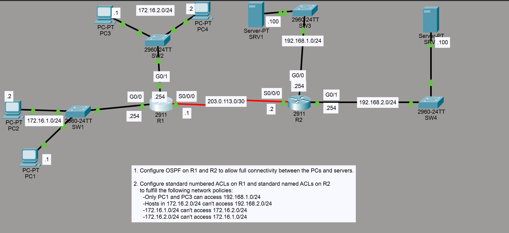

# Lab Overview
This lab demonstrates OSPF and ACL configuration.

The network has two main tasks involving:

1. Configuring OSPF on Router 1 and Router 2.
2. Configuring ACLs on both Routers based on these requirements:
              -Only PC1 and PC3 can access 192.168.1.0/24
              -Hosts in 172.16.2.0/24 can't access 192.168.2.0/24
              -172.16.1.0/24 can't access 172.16.2.0/24
              -172.16.2.0/24 can't access 172.16.1.0/24


## Configure the OSPF on both routers (they are connected by serial link)

Router 1
```
router ospf 1
network 203.0.113.0 0.0.0.255 area 0
network 192.168.1.0 0.0.0.255 area 0
network 192.168.2.0 0.0.0.255 area 0
auto-cost reference-banwidth 10000
```

Router 2
```
router ospf 1
network 203.0.113.0 0.0.0.255 area 0
network 172.16.1.0 0.0.0.255 area 0
network 172.16.2.0 0.0.0.255 area 0
auto-cost reference-banwidth 10000
```

## Configure the ACLs on both routers

Router 2 (Only PC1 and PC3 can access 192.168.1.0/24)
```
access-list 1 permit 172.16.1.1 0.0.0.0
access-list 1 permit 172.16.2.1 0.0.0.0

interface g0/0
ip access-group 1 out
```

Router 2 (Hosts in 172.16.2.0/24 can't access 192.168.2.0/24)
```
access-list 2 deny 172.16.2.0 0.0.0.255
access-list 2 permit any

interface g0/1
ip access-group 2 out
````

Router 1 (172.16.1.0/24 can't access 172.16.2.0/24)
```
access-list 3 deny 172.16.1.0 0.0.0.255
access-list 3 permit any

interface g0/1
ip access-group 3 out
```

Router 1 (172.16.2.0/24 can't access 172.16.1.0/24)
```
access-list 4 deny 172.16.2.0 0.0.0.255
access-list 4 permit any

interface g0/0
ip access-group 4 out
```


