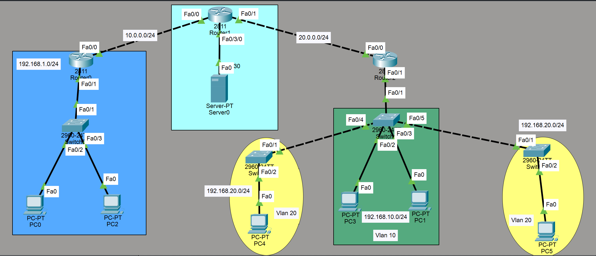

# Lab Overview
This lab demonstrates DHCP and VLAN configuration (OSPF pre-configured).

The network has two main tasks involving:

1. Configure DHCP server to provides IP addresses to other subnets
2. Configure relay-routers 
3. Configure SVI to get the IP address from the DHCP server
4. Configure the VLANs with ACL to block VLANs communication


# DHCP server configuration
## Subnet 192.168.1.0/24
```
subnet 192.168.1.0 netmask 255.255.255.0 {
    range 192.168.1.10 192.168.1.250;
    option routers 192.168.1.1;
    option domain-name-servers 8.8.8.8, 8.8.4.4;
    option domain-name "local.lan";
    default-lease-time 600;
    max-lease-time 7200;
}
```

## Subnet 192.168.2.0/24
```
subnet 192.168.2.0 netmask 255.255.255.0 {
    range 192.168.2.10 192.168.2.250;
    option routers 192.168.2.1;
    option domain-name-servers 8.8.8.8, 8.8.4.4;
    option domain-name "local.lan";
    default-lease-time 600;
    max-lease-time 7200;
}
```

## Subnet 192.168.3.0/24
```
subnet 192.168.3.0 netmask 255.255.255.0 {
    range 192.168.3.10 192.168.3.250;
    option routers 192.168.3.1;
    option domain-name-servers 8.8.8.8, 8.8.4.4;
    option domain-name "local.lan";
    default-lease-time 600;
    max-lease-time 7200;
}
```

## Pool for VLAN 10
```
ip dhcp pool VLAN10
 network 192.168.10.0 255.255.255.0
 default-router 192.168.10.1
 dns-server 8.8.8.8
```

## Pool for VLAN 20
```
ip dhcp pool VLAN20
 network 192.168.20.0 255.255.255.0
 default-router 192.168.20.1
 dns-server 8.8.8.8
```

# The port of router 1 connected to DHCP is in switchport mode (Enable SVI to get IP)
## Router 1
```
en
conf t
interface vlan 30
ip address dhcp
exit

interface fa0/0
ip address 10.0.0.1 255.255.255.0 
ip helper-address 192.168.2.1
no shutdown
exit

interface fa0/1
ip address 20.0.0.1 255.255.255.0
ip helper-address 192.168.2.1
no shutdown
exit 

ip dhcp relay information trust-all
```


## Router 0
```
en 
conf t
interface fa0/1
ip address 192.168.1.1 255.255.255.0
ip helper-address 192.168.2.1
no shutdown
exit

interface fa0/0
ip address 10.0.0.2 255.255.255.0
no shutdown
exit 

ip dhcp relay information trust-all

```

## Router 2
```
en 
conf t
interface fa0/1
ip address 192.168.3.1 255.255.255.0
ip helper-address 192.168.2.1
no shutdown
exit

interface fa0/0.10
encapsulation dot1Q 10
ip address 192.168.10.1 255.255.255.0
ip helper-address 192.168.2.1   
exit

interface fa0/0.20
encapsulation dot1Q 20
ip address 192.168.20.1 255.255.255.0
ip helper-address 192.168.2.1    
exit 

interface fa0/0
ip address 20.0.0.2 255.255.255.0
no shutdown
exit 

ip dhcp relay information trust-all

ip access-list extended BLOCK_VLAN10
deny ip 192.168.10.0 0.0.0.255 192.168.20.0 0.0.0.255
permit ip any any
exit

interface fa0/1.10
ip access-group BLOCK_VLAN10 in
exit
```


## Switch 3 and Switch 2
```
en
conf t
interface fa0/2
switchport mode access
switchport access vlan 20
exit

interface fa0/1
switchport mode trunk
switchport trunk allowed vlan 20
exit
```


## Switch 1
```
en
conf t
interface fa0/2
switchport mode access
switchport access vlan 10
exit

interface fa0/4
switchport mode trunk
switchport trunk allowed vlan 10,20
exit

interface fa0/5
switchport mode trunk
switchport trunk allowed vlan 10,20
exit
```
