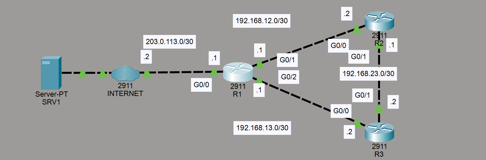

# Lab Overview
This lab demonstrates NTP configuration.

The network has two main tasks involving:
1. Configure the software clock on R1, R2, and R3 to 12:00:00 Dec 30 2020 (UTC).
2. Configure the time zone of R1, R2, and R3 to match your own.
3. Configure R1 to synchronize to NTP server 1.1.1.1 over the Internet.
4. Configure R1 as a stratum 8 NTP master. Synchronize R2 and R3 to R1 with authentication.


## Configure Router 1
```
R1# clock set 12:00:00 30 Dec 2020
R1(config)# clock timezone AEDT 9
R1(config)# ntp server 1.1.1.1
R1(config)# ntp authentication-key 1 md5 Mypassword
R1(config)# ntp authenticate
R1(config)# ntp trusted-key 1
R1(config)# ntp master 8

```

## Configure Router 2
```
R2# clock set 12:00:00 30 Dec 2020
R2(config)# clock timezone AEDT 9
R2(config)# ntp authentication-key 1 md5 Mypassword
R2(config)# ntp authenticate
R2(config)# ntp trusted-key 1
R2(config)# ntp server 192.168.12.1 key 1
```

## Configure Router 3
```
R3# clock set 12:00:00 30 Dec 2020
R3(config)# clock timezone AEDT 9
R3(config)# ntp authentication-key 1 md5 Mypassword
R3(config)# ntp authenticate
R3(config)# ntp trusted-key 1
R3(config)# ntp server 192.168.13.1 key 1
```


